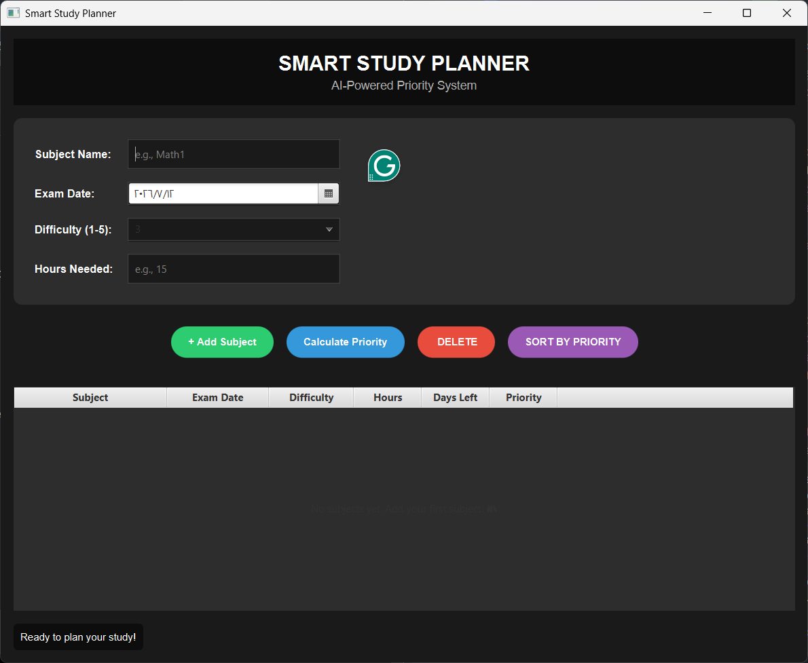

# Smart Study Planner

A desktop application built with Java and JavaFX that helps students organize their study schedule by calculating subject priorities based on exam dates, difficulty, and estimated study hours.

---

## Features

- Add study subjects
- Calculate subject priority
- Sort subjects by priority
- Delete subjects
- Display remaining days until exams
- Modern dark-themed user interface

---

## Technologies

- Java
- JavaFX
- IntelliJ IDEA

---

## My Contribution

This project was developed as part of a university assignment.

My contributions included:

- Designing the user interface using JavaFX
- Implementing the priority calculation logic
- Building the subject management functionality
- Creating the sorting feature
- Connecting the UI with the application logic

---

## Future Improvements

- Save subjects to a database
- Edit existing subjects
- Notifications before exams
- Export study schedule
- Dark/Light mode switching

---

## Screenshot

